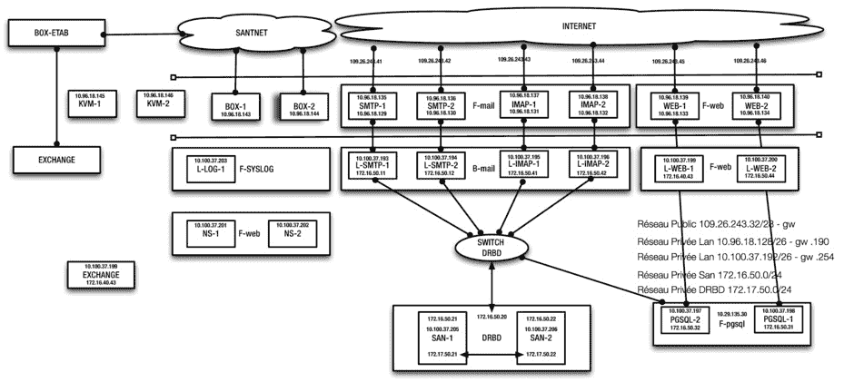

# 11.用例:用数据库后端配置负载平衡的邮件前端

## 客户情况

本章描述的配置是我所创建的最复杂的集群的一部分。事实上，它不仅仅是一个集群，它是一组协同工作的集群，提供了一个高度冗余的环境，供法国的医学博士用来访问基于 web 的邮箱。在本章中，我只讨论了配置的一部分，其中两个集群协同工作来传递电子邮件。

该客户预计会有大量的工作负载，因此希望环境不仅从高可用性的角度来看是冗余的，而且还能提供简化的负载平衡服务。该解决方案必须是可移植的，并作为设备部署在客户站点；因此，它必须包含内部的所有内容，不依赖于外部硬件或其他资源。因此，负载平衡由循环域名系统(DNS)负责。

使用循环 DNS 的一个挑战是，它完全不知道循环配置中 IP 地址的当前状态。在循环 DNS 中，为一个 DNS 名称配置了多个 IP 地址。第一个连接获得第一个 IP 地址，第二个连接获得第二个 IP 地址，依此类推。但是，如果其中一个 IP 地址变得不可用，循环 DNS 将永远不会知道。因此，群集在群集的公共站点上配置了“浮动”IP 地址。这些浮动 IP 地址可确保在循环 DNS 配置中配置的所有 IP 地址始终可用，即使其中一台服务器出现故障也是如此。这允许用户随时访问 IP 地址后面的 Postfix 邮件服务器。

在后端，客户使用的应用程序需要访问 Postgres 数据库。由于该解决方案必须始终高度可用，Postgres 数据库也采用了集群配置。请注意，在概览图中，集群集合正在访问的数据位于开源 SAN 解决方案上，如第 9 章中的[所述。图](09.html) [11-1](#Fig1) 给出了配置的概述。

图 11-1。

Use case overview

## 数据库后端

本章描述的集群的后端是数据库。这个集群相对简单，运行在 KVM 虚拟机上。因为 KVM 被用作平台，所以这个集群中的 STONITH 代理是基于`libvirt`的，正如您在清单 11-1 的示例代码中看到的。

清单 11-1。数据库集群

`chimay:∼ # cat cluster-santnet-pgsql-new.conf`

`node pgsql-1.example.com`

`node pgsql-2.example.com`

`primitive db-pgsql ocf:heartbeat:pgsql \`

`op stop interval="0" timeout="120" \`

`op start interval="0" timeout="120" \`

`op monitor interval="30" timeout="30" \`

`meta target-role="Started"`

`primitive dlm ocf:pacemaker:controld \`

`op start interval="0" timeout="90" \`

`op stop interval="0" timeout="100" \`

`op monitor interval="10" timeout="20" start-delay="0"`

`primitive ip-pgsql ocf:heartbeat:IPaddr2 \`

`params cidr_netmask="24" ip="192.168.50.30" \`

`op stop interval="0" timeout="20s" \`

`op start interval="0" timeout="20s" \`

`op monitor interval="10s" timeout="20s"`

`primitive o2cb ocf:ocfs2:o2cb \`

`op stop interval="0" timeout="100" \`

`op start interval="0" timeout="90" \`

`op monitor interval="20" timeout="20"`

`primitive ocfs2-fs-pgsql ocf:heartbeat:Filesystem \`

`params fstype="ocfs2" device="/dev/disk/by-path/ip-172.16.50.20:3260-iscsi-iqn.2014-02.santnet.sante:target1-lun-0-part1" directory="/var/lib/pgsql" \`

`op stop interval="0" timeout="60" \`

`op start interval="0" timeout="60" \`

`op monitor interval="20" timeout="40"`

`primitive stonith-vmkvm-pgsql-1 stonith:external/libvirt \`

`params hostlist="pgsql-1" hypervisor_uri="qemu+ssh://chimay/system" \`

`op monitor interval="60" timeout="20" start-delay="15" \`

`op stop interval="0" timeout="15" \`

`op start interval="0" timeout="20" \`

`meta target-role="Started"`

`primitive stonith-vmkvm-pgsql-2 stonith:external/libvirt \`

`params hostlist="pgsql-2" hypervisor_uri="qemu+ssh://chimay/system" \`

`op monitor interval="60" timeout="20" start-delay="15" \`

`op stop interval="0" timeout="15" \`

`op start interval="0" timeout="20" \`

`meta target-role="Started"`

`group ocfs2-base-group dlm o2cb`

`group pgsql-group ip-pgsql db-pgsql \`

`meta target-role="Started"`

`clone ocfs2-base-clone ocfs2-base-group \`

`meta ordered="true" interleaved="true" clone-max="2" clone-node-max="1" target-role="Started"`

`clone ocfs2-fs-clone ocfs2-fs-pgsql \`

`meta target-role="Started"`

`location fence-pgsql-1 stonith-vmkvm-pgsql-1 -inf: pgsql-1.example.com`

`location fence-pgsql-2 stonith-vmkvm-pgsql-2 -inf: pgsql-2.example.com`

`order ocfs2-fs-pgsql-after-ocfs2-base 1000: ocfs2-base-clone ocfs2-fs-clone`

`property $id="cib-bootstrap-options" \`

`dc-version="1.1.6-b988976485d15cb702c9307df55512d323831a5e" \`

`cluster-infrastructure="openais" \`

`expected-quorum-votes="2" \`

`no-quorum-policy="ignore" \`

`stonith-action="poweroff" \`

`last-lrm-refresh="1393400151"`

在设置数据库集群时，这可以是一个`active/active`设置、一个`master-slave`设置或一个`active/passive`设置。你可能会认为设置必须是`active/active`或`master-slave`，但这在大多数情况下并不是必需的。

`active/active`只有在高负载环境下才需要数据库配置。这同样适用于`master-slave`配置。此外，在几乎所有情况下，要创建一个`master-slave`配置，需要数据库本身的支持。在大多数情况下，这种支持也意味着必须购买额外的许可证，这使得`master-slave`配置通常相对昂贵。

`master-slave`数据库配置和`active/passive`配置的主要区别在于，在`master/slave`配置中，从数据库已经加载并同步。结果是，如果主服务器关闭，从服务器可以很快接管。这允许数据库对集群中的问题做出快速反应。在`active/passive`配置中，该过程要慢得多。

The cluster must detect that the active database is no longer responding.   If the entire node hosting the active database is no longer responding, the node has to be fenced.   The database has to load on the other cluster node.  

在这里讨论的示例集群中，使用了 OCFS2 文件系统。请注意，这并不是对`active/passive`数据库配置的真正要求，但是客户非常喜欢克隆 OCFS2 文件系统。这种配置还有一个好处。

如果创建的集群中 Ext4 或 XFS 文件系统是集群资源的一部分，则损坏的风险会更高。当节点 2 认为节点 1 停机，向该节点发送 STONITH，STONITH 失败，但资源仍被迁移时，可能会出现这种损坏。没错，这不是一个极有可能发生的场景，但却是一个值得考虑的真实场景。(事实上，我看到过这样的场景，不是因为 STONITH 失败了，而是因为集群的管理员犯了一个愚蠢的错误。)如果出现这种情况，您可能会以两个数据库结束，两个数据库都写入同一个文件系统，而您并没有意识到这一点。最终的结果是文件系统将被损坏。为了确保这种情况不会发生，在这种情况下，使用了 OCFS2 文件系统。

这个集群配置中有趣的部分是不同性质的资源的依赖关系。首先是`ocfs2-base-group`资源，它负责加载`dlm`和`o2cb`(任何 OCFSs 文件系统的先决条件)。接下来是`ocfs2-base-clone`，它只能在`ocfs2-base-group`资源被加载后加载。只有当`ocfs2-base-clone`加载成功后，才能加载`pgsql-group`。确保这正确发生的唯一方法是使用`order`约束。

首先，在`ocfs2-base-group`之后加载 OCFS2 文件系统需要一个`order`约束。接下来，在`pgsql-group`和`ocfs2-file-system`之间定义一个`order`约束。注意，在清单 11-1 中，缺少了第二个约束。(这就是谈论现实生活中的配置时会发生的情况，这为与客户建立新的联系提供了一个很好的机会。)

## 邮件前端

如前所述，邮件前端必须支持循环域名系统(DNS)负载平衡(这与该集群的其余部分无关)。因此，定义了浮动 IP 地址。在此群集中，提供了 Internet 邮件访问协议(IMAP)服务和简单邮件传输协议(SMTP)服务。其思想是 SMTP 服务优先选择集群中的两个特定节点，而 IMAP 服务优先选择集群中的另外两个特定节点。为此，您可以看到在这个集群中使用了几个约束。

这个集群有趣的地方在于浮动 IP 地址。SMTP 服务器的 SMTP 地址可以运行在`smtp-1`或`smtp-2`主机上，IMAP 服务器的地址可以运行在`imap-1`或`imap-2`主机上。请注意，这些约束中使用的分数仅设置为 1，000。这个分数确保了如果两个 SMTP 服务器都关闭，该 IP 地址仍将由 IMAP 服务器提供服务。

SMTP 服务在此群集中也起着重要的作用。它必须启动两次，一次在每个 SMTP 节点上。这是通过将原语放在一个具有位置约束的`clone`资源中来实现的，该资源的得分设置为`-inf`，这意味着从不在 IMAP 服务器上运行。在清单 11-2 中，您可以看到这个邮件前端集群的完整配置。

清单 11-2。用例邮件前端群集

`chimay:∼ # cat cluster-santnet-4node-extern.conf`

`node imap-1.msexample.com`

`node imap-2.msexample.com`

`node smtp-1.msexample.com`

`node smtp-2.msexample.com`

`primitive ip-smtp-1 ocf:heartbeat:IPaddr2 \`

`params ip="194.0.153.51" cidr_netmask="24" \`

`op stop interval="0" timeout="20s" \`

`op monitor interval="10s" timeout="20s" \`

`op start interval="0" timeout="20s" \`

`meta target-role="Started"`

`primitive ip-smtp-2 ocf:heartbeat:IPaddr2 \`

`params ip="194.0.153.52" cidr_netmask="24" \`

`op stop interval="0" timeout="20s" \`

`op monitor interval="10s" timeout="20s" \`

`op start interval="0" timeout="20s" \`

`meta target-role="Started"`

`primitive ip-imap-1 ocf:heartbeat:IPaddr2 \`

`params ip="194.0.153.53" cidr_netmask="24" \`

`op stop interval="0" timeout="20s" \`

`op monitor interval="10s" timeout="20s" \`

`op start interval="0" timeout="20s" \`

`meta target-role="Started"`

`primitive ip-imap-2 ocf:heartbeat:IPaddr2 \`

`params ip="194.0.153.54" cidr_netmask="24" \`

`op stop interval="0" timeout="20s" \`

`op monitor interval="10s" timeout="20s" \`

`op start interval="0" timeout="20s" \`

`meta target-role="Started"`

`primitive service-postfix-1 ocf:heartbeat:postfix \`

`op stop interval="0" timeout="60" \`

`op start interval="0" timeout="60" \`

`op monitor interval="20" timeout="40" \`

`meta target-role="Started"`

`primitive stonith-vmkvm-imap-1 stonith:external/libvirt \`

`params hostlist="imap-1.msexample.com" hypervisor_uri="qemu+ssh://192.168.50.254/system" \`

`op monitor interval="60" timeout="20" start-delay="15" \`

`op stop interval="0" timeout="15" \`

`op start interval="0" timeout="20" \`

`meta target-role="Started"`

`primitive stonith-vmkvm-imap-2 stonith:external/libvirt \`

`params hostlist="imap-2.msexample.com" hypervisor_uri="qemu+ssh://192.168.50.254/system" \`

`op monitor interval="60" timeout="20" start-delay="15" \`

`op stop interval="0" timeout="15" \`

`op start interval="0" timeout="20" \`

`meta target-role="Started"`

`primitive stonith-vmkvm-smtp-1 stonith:external/libvirt \`

`params hostlist="smtp-1.msexample.com" hypervisor_uri="qemu+ssh://192.168.50.254/system" \`

`op monitor interval="60" timeout="20" start-delay="15" \`

`op stop interval="0" timeout="15" \`

`op start interval="0" timeout="20" \`

`meta target-role="Started"`

`primitive stonith-vmkvm-smtp-2 stonith:external/libvirt \`

`params hostlist="smtp-2.msexample.com" hypervisor_uri="qemu+ssh://192.168.50.254/system" \`

`op monitor interval="60" timeout="20" start-delay="15" \`

`op stop interval="0" timeout="15" \`

`op start interval="0" timeout="20" \`

`meta target-role="Started"`

`clone smtp-clone service-postfix-1 \`

`meta clone-max="2" target-role="Started" clone-node-max="1"`

`location clone-postfix-loc smtp-clone \`

`rule $id="clone-postfix-loc-rule" -inf: #uname eq imap-2.msexample.com or #uname eq imap-1.msexample.com`

`location fence-imap-1 stonith-vmkvm-imap-1 -inf: imap-1.msexample.com`

`location fence-imap-2 stonith-vmkvm-imap-2 -inf: imap-2.msexample.com`

`location fence-smtp-1 stonith-vmkvm-smtp-1 -inf: smtp-1.msexample.com`

`location fence-smtp-2 stonith-vmkvm-smtp-2 -inf: smtp-2.msexample.com`

`location ip-imap-1-loc ip-imap-1 \`

`rule $id="ip-imap-1-loc-rule" 1000: #uname eq imap-1.msexample.com or #uname eq imap-2.msexample.com`

`location ip-imap-2-loc ip-imap-2 \`

`rule $id="ip-imap-2-loc-rule" 1000: #uname eq imap-2.msexample.com or #uname eq imap-1.msexample.com`

`location ip-smtp-1-loc ip-smtp-1 \`

`rule $id="ip-smtp-1-loc-rule" 1000: #uname eq smtp-1.msexample.com or #uname eq smtp-2.msexample.com`

`location ip-smtp-2-loc ip-smtp-2 \`

`rule $id="ip-smtp-2-loc-rule" 1000: #uname eq smtp-2.msexample.com or #uname eq smtp-1.msexample.com`

`property $id="cib-bootstrap-options" \`

`dc-version="1.1.6-b988976485d15cb702c9307df55512d323831a5e" \`

`cluster-infrastructure="openais" \`

`expected-quorum-votes="4" \`

`stonith-action="poweroff" \`

`last-lrm-refresh="1391077071"`

## 一个大集群还是许多小集群？

创建此解决方案时出现的一个问题是采用哪种方法。两种不同的解决方案是可能的。可以选择创建一个大型集群，在本例中总共有 14 台主机，它们试图处理所有服务。在这个环境中，我选择了许多集群相互通信的解决方案。

为了确定您是需要一个大集群还是许多小集群，衡量服务之间的依赖关系是很重要的。如果存在复杂的依赖关系，并且您希望在一些依赖资源出现故障时移动资源，那么将它们全部放在一个大集群中是有意义的。在这种配置中，情况并非如此。邮件前端集群和数据库后端集群之间的通信只是基于 IP 地址，不需要定义其他依赖关系。这就是为什么在这个解决方案中，配置是用许多小集群创建的。这种配置的优点是可以相对容易地将注意力集中在特定问题上。如果已经创建了一个大集群，那么定义资源之间关系的复杂约束的需求将会大得多。这还会导致更难获得集群中资源的概况。

## 摘要

在本章中，您已经了解了如何使用 Pacemaker 来创建一个复杂的配置，其中多个集群协同工作来创建一个大的解决方案，在该解决方案中一切都是高度可用的。随着 IT 解决方案变得越来越复杂，这样的解决方案也越来越常见。如果需要一种配置，其中多个节点必须协同工作以提供高可用性的解决方案，则创建多个相互通信的集群的方法比一个大型集群试图托管所有节点的解决方案更可取。通过使用几个独立的集群，管理变得更加容易。